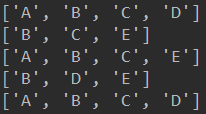
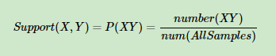
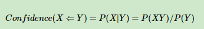
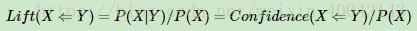
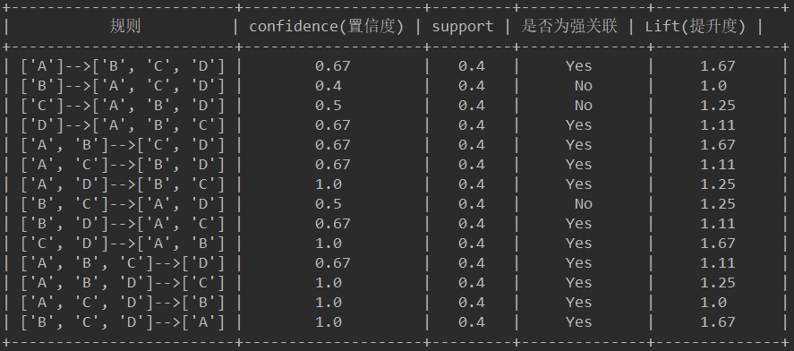
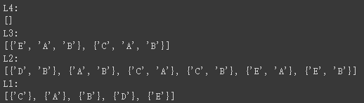
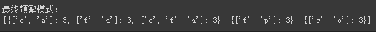

## 强关联规则

代码查看：[Apriori.py](Apriori.py)  

源数据： [data.xlsx](data.xlsx) 

第一步，递归算出频繁项目集以及最大频繁项目集：
> 频繁项目集： 
>[['A'], ['B'], ['C'], ['D'], ['E'], ['A', 'B'], ['A', 'C'], ['A', 'D'], ['B', 'C'], ['B', 'D'], ['B', 'E'], ['C', 'D'], ['C', 'E'], ['A', 'B', 'C'], ['A', 'B', 'D'], ['A', 'C', 'D'], ['B', 'C', 'D'], ['B', 'C', 'E'], ['A', 'B', 'C', 'D']] 
 
 
>最大频繁项目集：  
>['A', 'B', 'C', 'D'] 

原理：  
 
支持度的计算： 

 
置信度的计算：

 
提升度的计算：

 
运行结果：

***

## Close 

代码查看：[Close.py](close.py)  

 

***

## FP-Tree 

代码查看：[FP-Tree.py](fp_tree.py)  

 

 