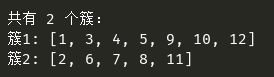

## DBSCAN 

算法描述： 
输入：包含N个对象的数据库，半径R，最少数目MinPts 
输出：所有生成的簇，达到密度要求 
 

Repeat: 
&emsp;&emsp;从数据库中抽取一个未处理过的对象； 
&emsp;&emsp;If 抽出的对象是核心点 
&emsp;&emsp;&emsp;&emsp;找出所有从该点密度可达的对象，形成一个簇; 
&emsp;&emsp;Else 抽出的点是边缘点（非核心对象）
&emsp;&emsp;&emsp;&emsp;跳出循环，寻找下一点;  
Until 所有点都被访问过 

 

结果： 
