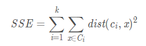
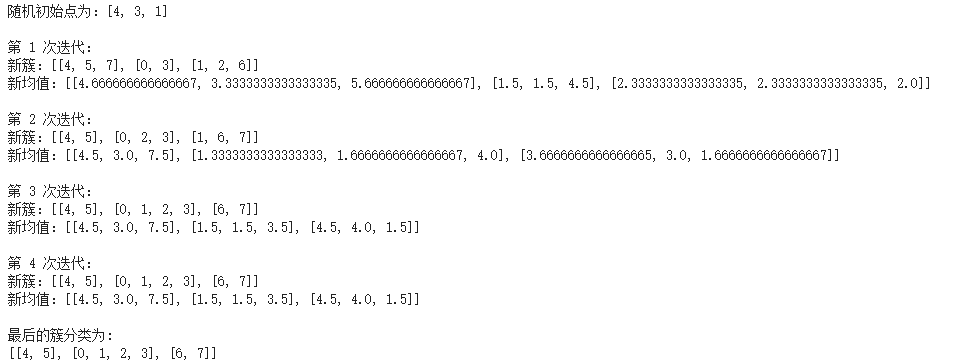

## K-means K-均值

代码查看：[K-means.py](K-means.py)  

源数据： 随机产生

 
1)随机产生数据集，每个数据k个属性 
2)从数据集中随机选择k个原始数据，作为簇中心 
3)根据距离函数计算每个数据离簇中心的距离，选择最近的簇重新分配 
4)计算新簇的平均值，作为新簇的中心 
5)循环3-4步，直到簇中心不在变化 
 
准则函数： 

运行结果：

