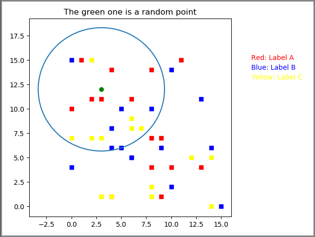
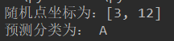

## KNN(K-近邻)

代码查看：[KNN.py](KNN.py)  

源数据： 随机产生

 
1)随机产生数据集，并生成要预测类别的点 
2)计算数据集中每个点到预测点的距离 
3)取K个离预测点最近的数据（坐标），在本例中k=20 
4)在K个样本中选出样本类别最多的类别（Label) 
5)预测预测点属于Label 

注意：K值取值时，不宜过大或过小，否则会出现误差较大的结果 
 

运行结果：

